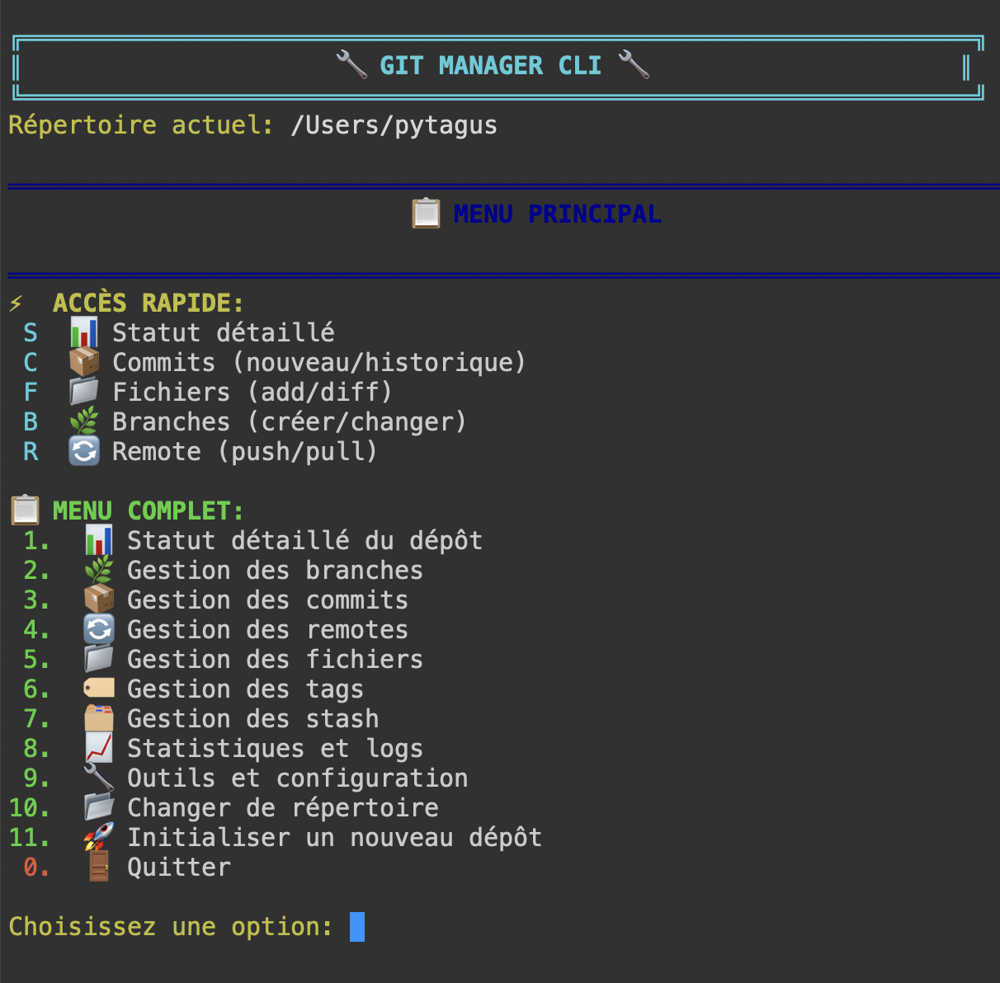

# gitman
Gitman est un Git Manager CLI écrit en Go : Interface TUI intuitive avec stats temps réel, suggestions contextuelles et raccourcis rapides



**GitMan** est un gestionnaire Git CLI moderne et intelligent qui simplifie et améliore votre workflow Git quotidien. Avec son interface colorée, ses raccourcis intelligents et ses suggestions contextuelles, GitMan transforme Git en un outil plus accessible et efficace.

## ✨ Caractéristiques principales

### 🚀 **Interface intelligente et intuitive**
- **Statut intelligent** avec analyse contextuelle du dépôt
- **Suggestions automatiques** basées sur l'état actuel
- **Raccourcis rapides** pour les actions courantes (S, C, F, B, R)
- **Interface colorée** avec codes couleur intuitifs

### 🎯 **Accès rapide aux fonctions essentielles**
- **S** - Statut détaillé avec analyse intelligente
- **C** - Gestion des commits (nouveau/historique)
- **F** - Gestion des fichiers (add/diff)
- **B** - Gestion des branches (créer/changer)
- **R** - Gestion des remotes (push/pull)

### 📊 **Fonctionnalités avancées**
- Statistiques détaillées du dépôt et des contributeurs
- Gestion complète des branches, tags et stash
- Outils de nettoyage et d'optimisation
- Gestion des hooks Git
- Recherche avancée dans l'historique

## 🛠️ Installation

### Prérequis
- **Go 1.19+** installé sur votre système
- **Git** configuré et accessible via le PATH

### Installation depuis les sources

```bash
# Cloner le dépôt
git clone https://github.com/your-username/gitman.git
cd gitman

# Compiler l'exécutable
go build -o gitman gitman.go

# Rendre exécutable (Linux/macOS)
chmod +x gitman

# Optionnel : Ajouter au PATH pour accès global
sudo mv gitman /usr/local/bin/
```

### Installation directe avec Go

```bash
go install github.com/your-username/gitman@latest
```

## 🚀 Utilisation rapide

### Démarrage
```bash
# Dans un dépôt Git existant
gitman

# Ou changer de répertoire depuis l'interface
# Option 10 dans le menu principal
```

### Raccourcis essentiels
Une fois dans GitMan, utilisez ces touches pour un accès instantané :

| Raccourci | Fonction | Description |
|-----------|----------|-------------|
| **S** | Statut | Analyse intelligente du dépôt avec suggestions |
| **C** | Commits | Créer un commit ou voir l'historique |
| **F** | Fichiers | Ajouter des fichiers ou voir les différences |
| **B** | Branches | Créer/changer de branche rapidement |
| **R** | Remote | Push/Pull et synchronisation |

## 📋 Fonctionnalités détaillées

### 🔍 **1. Statut intelligent (S)**
Le statut intelligent de GitMan va au-delà du simple `git status` :

- **Analyse contextuelle** : Détecte automatiquement votre situation (fichiers modifiés, commits en attente, etc.)
- **Suggestions intelligentes** : Propose des actions basées sur l'état actuel
- **Informations de synchronisation** : Affiche les commits en avance/retard par rapport au remote
- **Statistiques en temps réel** : Nombre de fichiers modifiés, en stage, non suivis

### 📦 **2. Gestion des commits (C)**
**Commit rapide :**
- Détection automatique des fichiers en stage
- Interface simplifiée pour les commits fréquents
- Accès direct à l'historique

**Fonctionnalités avancées :**
- Modification du dernier commit (amend)
- Reset et revert avec options de sécurité
- Recherche dans l'historique des commits
- Affichage détaillé des commits avec couleurs

### 📁 **3. Gestion des fichiers (F)**
**Actions rapides :**
- Ajout de tous les fichiers en un clic
- Visualisation des différences
- Gestion du .gitignore

**Fonctionnalités complètes :**
- Unstage sélectif de fichiers
- Restauration de fichiers avec confirmation
- Gestion des fichiers non trackés
- Comparaison entre commits

### 🌿 **4. Gestion des branches (B)**
**Navigation rapide :**
- Création de branche avec checkout automatique
- Changement de branche avec liste interactive
- Affichage des branches récentes

**Gestion avancée :**
- Merge avec gestion des conflits
- Suppression sécurisée de branches
- Renommage de branches
- Visualisation des branches remote

### 🔄 **5. Synchronisation remote (R)**
**Actions rapides :**
- Push/Pull en un clic vers origin
- Détection automatique des commits en attente
- Status de synchronisation en temps réel

**Gestion complète :**
- Configuration de remotes multiples
- Fetch sélectif
- Gestion des remotes avec URLs

### 📊 **6. Statistiques et analyse**
- **Statistiques générales** : Commits, branches, tags, taille du dépôt
- **Analyse des contributeurs** : Activité par développeur et période
- **Historique visuel** : Graphique des branches avec couleurs
- **Statistiques par fichier** : Fichiers les plus modifiés, lignes ajoutées/supprimées

### 🏷️ **7. Gestion des tags**
- Création de tags simples et annotés
- Visualisation et suppression de tags
- Navigation dans les versions

### 🗂️ **8. Gestion du stash**
- Création de stash avec messages
- Application et suppression de stash
- Création de branches depuis un stash

### 🔧 **9. Outils et configuration**
- **Configuration Git** : User, email, éditeur
- **Nettoyage du dépôt** : Fichiers non trackés, optimisation
- **Vérification d'intégrité** : fsck, statistiques des objets
- **Gestion des hooks** : Activation, création, modification

## 🎨 Interface et expérience utilisateur

### Codes couleur
GitMan utilise un système de couleurs intuitif :

- 🟢 **Vert** : Actions réussies, fichiers en stage
- 🟡 **Jaune** : Avertissements, fichiers modifiés
- 🔴 **Rouge** : Erreurs, fichiers non suivis
- 🔵 **Bleu** : Informations, titres de sections
- 🟣 **Violet** : Remotes et synchronisation
- 🟦 **Cyan** : Branches et navigation

### Navigation intuitive
- **Menus numériques** pour la navigation complète
- **Raccourcis alphabétiques** pour l'accès rapide
- **Confirmations de sécurité** pour les actions destructives
- **Messages d'aide contextuels**

## 🔧 Configuration et personnalisation

GitMan utilise votre configuration Git existante et ne nécessite aucune configuration supplémentaire. Cependant, vous pouvez optimiser votre expérience :

### Configuration Git recommandée
```bash
# Couleurs Git (améliorent l'affichage dans GitMan)
git config --global color.ui auto

# Éditeur par défaut
git config --global core.editor "nano"  # ou vim, code, etc.

# Push par défaut
git config --global push.default simple
```

## 📚 Exemples d'utilisation

### Workflow typique de développement

1. **Vérifier le statut** : Lancez GitMan et tapez `S`
2. **Ajouter des fichiers** : Tapez `F` puis option 1
3. **Créer un commit** : Tapez `C` et entrez votre message
4. **Pousser les changements** : Tapez `R` puis option 1

### Gestion des branches

```bash
# Créer une nouvelle feature branch
B -> 1 -> "feature/nouvelle-fonctionnalite"

# Changer vers main pour merger
B -> 2 -> "main"

# Merger la feature branch
Menu principal -> 2 -> 5 -> "feature/nouvelle-fonctionnalite"
```

### Analyse du projet

```bash
# Voir les statistiques générales
Menu principal -> 8 -> 1

# Analyser les contributeurs
Menu principal -> 8 -> 2

# Rechercher dans l'historique
Menu principal -> 8 -> 7
```

## 🚨 Sécurité et bonnes pratiques

GitMan inclut plusieurs mécanismes de sécurité :

- **Confirmations obligatoires** pour les actions destructives (reset --hard, suppression de branches)
- **Aperçus avant action** (clean --dry-run avant nettoyage)
- **Sauvegarde automatique** avec stash avant certaines opérations
- **Vérification de l'état** du dépôt avant les actions critiques

### Actions avec confirmation requise
- Reset --hard
- Suppression de branches
- Nettoyage de fichiers non trackés
- Suppression de tags
- Clear stash

## 🐛 Dépannage

### Problèmes courants

**GitMan ne démarre pas :**
```bash
# Vérifier que vous êtes dans un dépôt Git
git status

# Ou initialiser un nouveau dépôt
git init
```

**Erreurs de couleur sur Windows :**
GitMan supporte les couleurs sur Windows 10+. Pour les versions antérieures, les couleurs peuvent ne pas s'afficher correctement.

**Commandes Git non trouvées :**
```bash
# Vérifier l'installation de Git
git --version

# Ajouter Git au PATH si nécessaire
```

### Logs et debug
GitMan affiche les erreurs Git directement dans l'interface. Pour plus de détails, vous pouvez toujours utiliser les commandes Git natives en parallèle.

## 🤝 Contribution

Les contributions sont les bienvenues ! Voici comment contribuer :

1. **Fork** le projet
2. **Créer** une branche pour votre feature (`git checkout -b feature/AmazingFeature`)
3. **Commit** vos changements (`git commit -m 'Add some AmazingFeature'`)
4. **Push** vers la branche (`git push origin feature/AmazingFeature`)
5. **Ouvrir** une Pull Request

### Guide de développement

```bash
# Cloner votre fork
git clone https://github.com/your-username/gitman.git
cd gitman

# Installer les dépendances (aucune externe requise)
go mod tidy

# Lancer en mode développement
go run gitman.go

# Tester et compiler
go build -o gitman gitman.go
```

### Standards de code
- Code commenté en français (cohérent avec l'interface)
- Fonctions modulaires et réutilisables
- Gestion d'erreur robuste
- Tests pour les nouvelles fonctionnalités

## 📄 Licence

Ce projet est sous licence MIT. Voir le fichier [LICENSE](LICENSE) pour plus de détails.

## 🙏 Remerciements

- **Git** - Le système de contrôle de version qui rend tout cela possible
- **La communauté Go** - Pour l'excellente documentation et les outils
- **Tous les contributeurs** - Merci pour vos améliorations et retours

---

**GitMan** - Rendez Git simple, intelligent et agréable à utiliser ! 🚀

[](https://golang.org/)
[](LICENSE)
